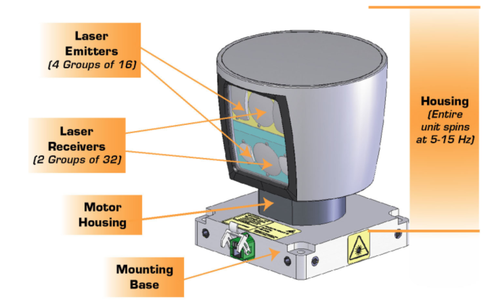

# Lidar

LiDAR (Light Detection And Ranging) sends out very short light pulses at different angles across the field of view and receives the photons reflected back from an object. It measures the time difference and determines the distance to the object. Thus, the data can be used to model a 3D environment.

#### Mechanical rotating LiDAR

#### 2D rotating mirror LiDAR

#### MEMs mirror LiDAR

#### Point Clouds

A point cloud is a set of all lidar reflection points measured. Each point is one laser beam reflected from an object.

- A PCD file contains a list of Point Cloud Data, with every point in the format of `(x, y, z, I)`
    * `(x, y, z)` is the Cartesian coordinates
        + telling us the location of the reflected surface on the object
        + `x` pointing towards the front of the car
        + `y` pointing to the left of the car
        + `z` pointing to the vertical up
    * `I` is the signal strength of the laser related to the reflective properties of the material

#### Sources
*   [Udacity-fanweng](https://github.com/fanweng/Udacity-Sensor-Fusion-Nanodegree/tree/main)
*   [Hesai Lidar](https://www.youtube.com/watch?v=3EehCU3csJQ)