# Radar

Radar transmits the EM waves (Tx) which travels through the space and bounces off the objects. Part of these reflected waves is received by the radar (Rx) along with the noise. Below image shows Tx and Rx in freq domain. a lot of Tx power is centered around a certain freq and Rx not only has lot less power in comparison to Tx also power is shifted due to dopper effect. Rx also has significant noise from the environment, electronics etc. Finding the peak of Rx is important to determine distance, velocity, angle of the object.

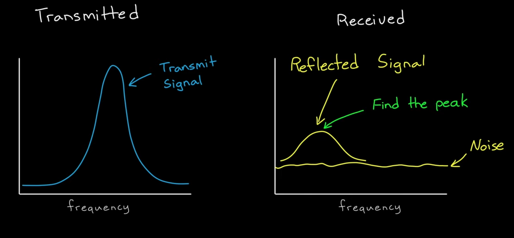

If the Rx is too low or SNR is too low (SNR 100% = full signal with 0 noise) in other words, low Rx power with high noise makes it unusable.

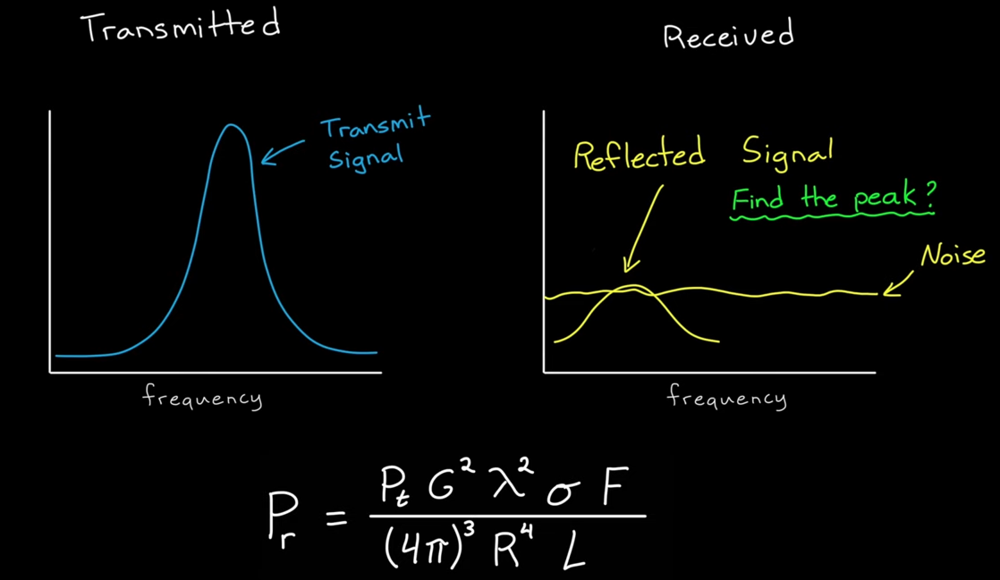

#### Radar equation

An isotropic radar as shown below transmits peak power $Pt$ in all direction equally with equal power density $(Pt/surface\ area)$  

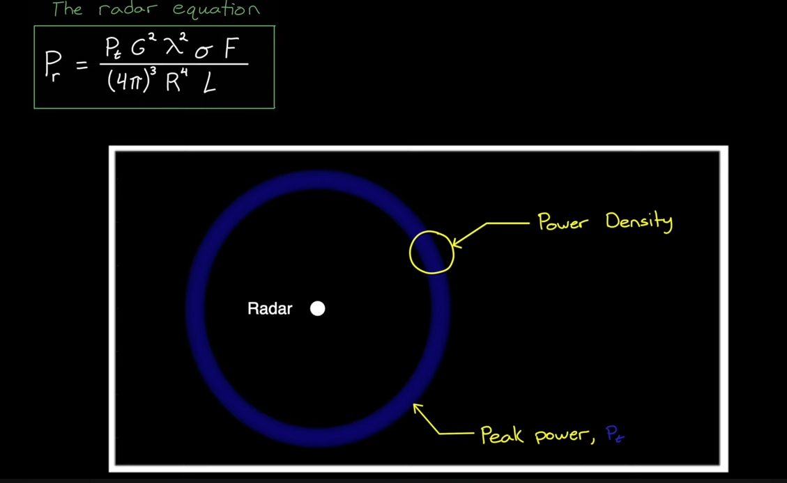

For a lot of practical systems, antenna transmits the power in a specific direction (TV antenna) concentrating the power in a specific direction. For the same peak power, power density has decreased (in comparision to isotropic antenna)in most directions and increased in the direction of the beam. This increase in the power density relative to the isotropic is the antenna gain $Gt$.

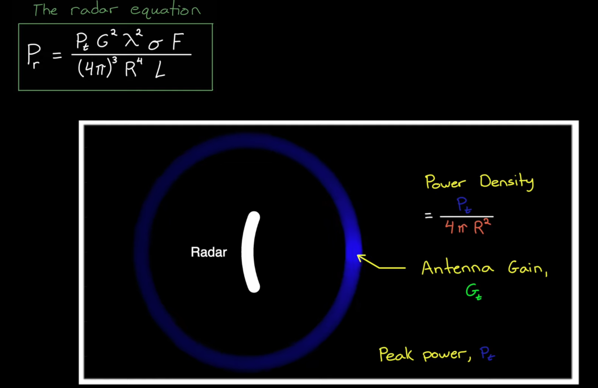

This Tx power will be attenuated while travelling through environment (Air, snow, rain etc) and attenuation is strong fucntion of transmit freq. This environmental attenuation is captured in a loss factor L >1.

As Tx travels through environment, an object with a area $A$ intercepts ($A *$ power density). RCS is what the area $A$ would be if the power that the object intercepts was re-radiated isotropically. 

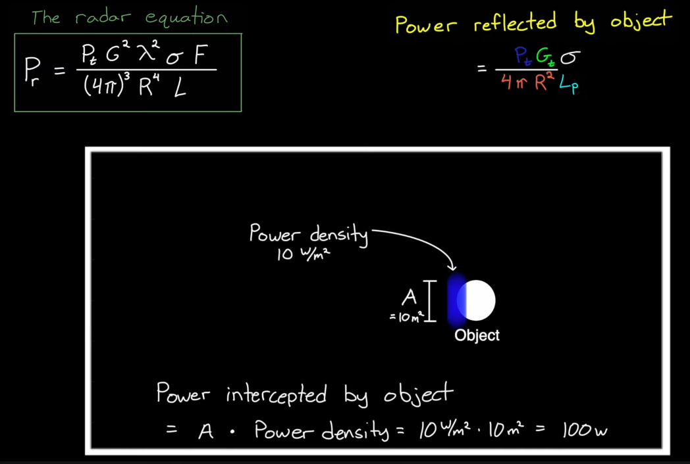

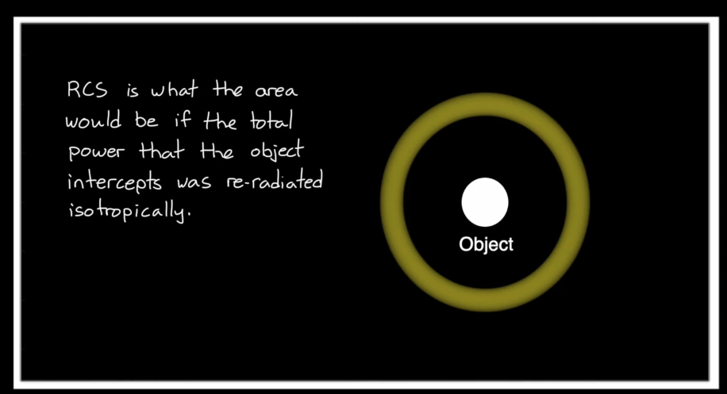

# Velocity measurements

#### Doppler effect

FMCW generator blasts the EM waves (Tx: microwave range, in GHz), waves hits the obejct and reflects back (Rx: microwave range, in GHz). The state of the object effects the frequency of the reflected wave.

  * Frequency unchanged : Stationary object
  * Frequency increased : Object approaching towards the radar
  * Frequency decreased : Object moving away from the radar

Radar detects this changes in the reflected frequency and correlates to the relative velocity of the object. Although Tx, Rx in GHz, changes in the frequency is in KHz and can be extremley difficult to detect the changes. Beat frequency makes it possible to detect the frequency changes easily.

#### Beat frequency

Frequency at which both Tx and Rx are in phase is called beat frequency. Beat frequency can be obtained by multiplying Tx and Rx. as shown below

  * Tx: $ sin(at) @100GHz$
  * Rx: $ sin(bt) @108GHz$ (Object is moving towards the radar delta frequeancy 8 GHz)
  * Bf: $ sin(at) * sin(bt) = \frac{1}{2}[cos(a-b)t - cos(a+b)t] $

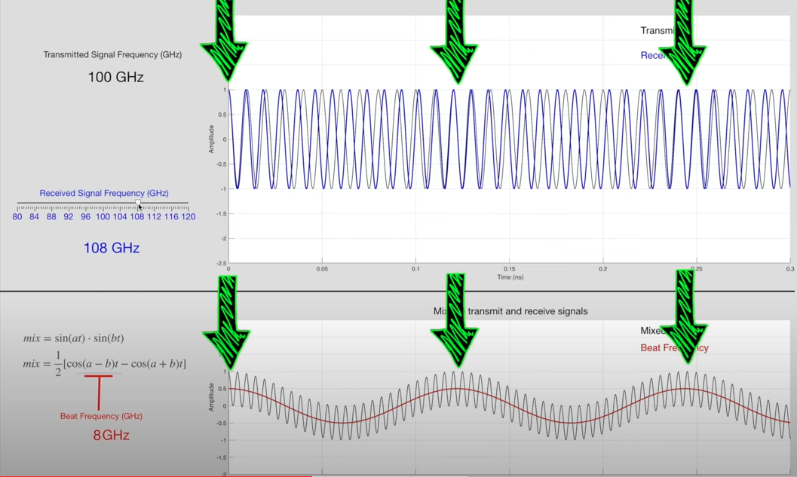

Result of multiplication of Tx and Rx is two waves which are superimposed on each other. One with high frequency $cos(a+b)t$ and one with low frequency $ cos(a-b)t$. This low freq singal is exactly in phase with the beat freq (Doppler change (delta) caused by the moving object). This low frequency signal can be easily filtered via a low pass filter. With this clever trick, one can only measure the velocity but not the heading direction. In order to measure both velocity and the heading direction IQ singals are used in practice. IQ will have 2 beat frequencies with a phase and leading phase of two singals reveals the heading direction. 

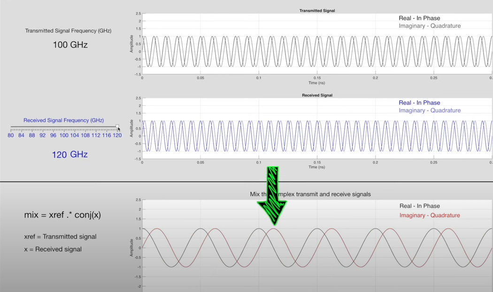

# Range (Distance)

Distance doesn't cause a doppler shift as velocity does. Instead, it produces a time shift beacuse of the time it takes for the signal to travel to the object and back. The further the object more the time it takes. With a fixed single freq singal, we cannot detect this delay as signal doesn't have any characteristic to measure time. Delay of one period looks same as $n * period$. Let's visualize in freq vs time curve.

Doppler effect in freq vs time curve

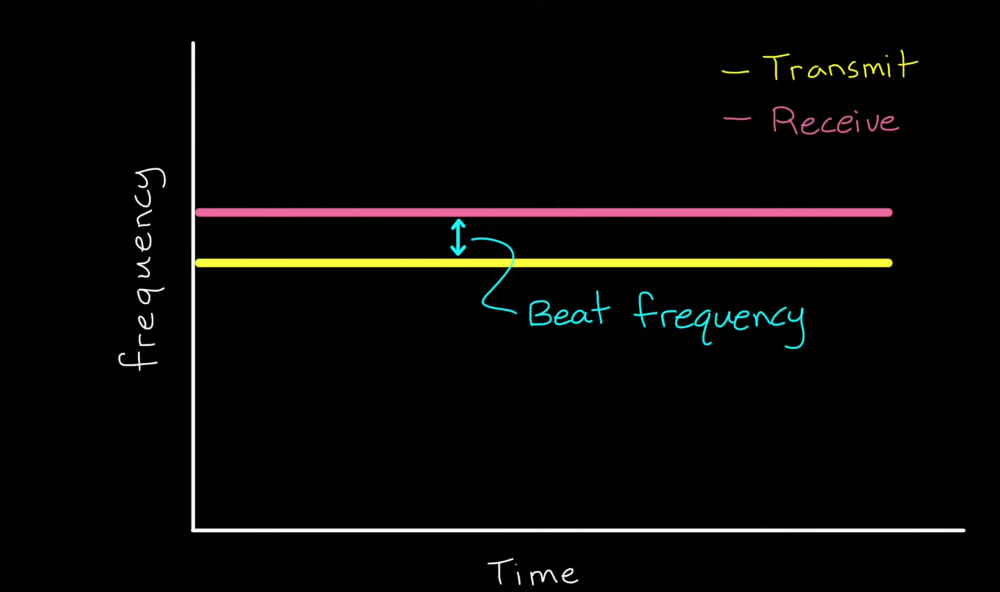

Distance produces time shift hence no beat freq

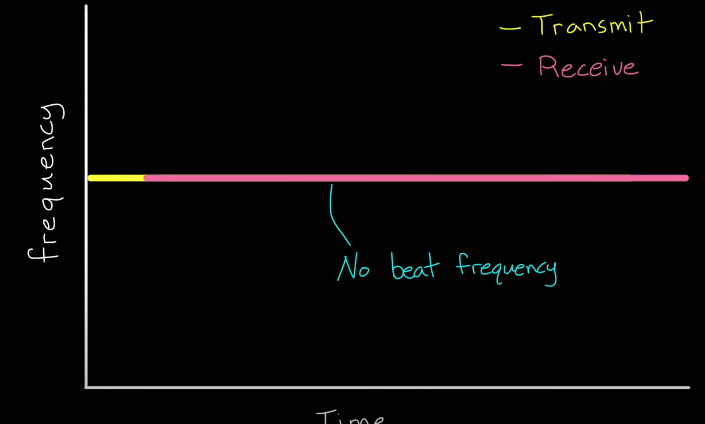

If Tx is freq modulated (Continuous ramp: Saw tooth), we can see time shift in terms of frequencies. However, we cannot know if this is caused by time shift and doppler shift or combination of time and Doppler shifts. 

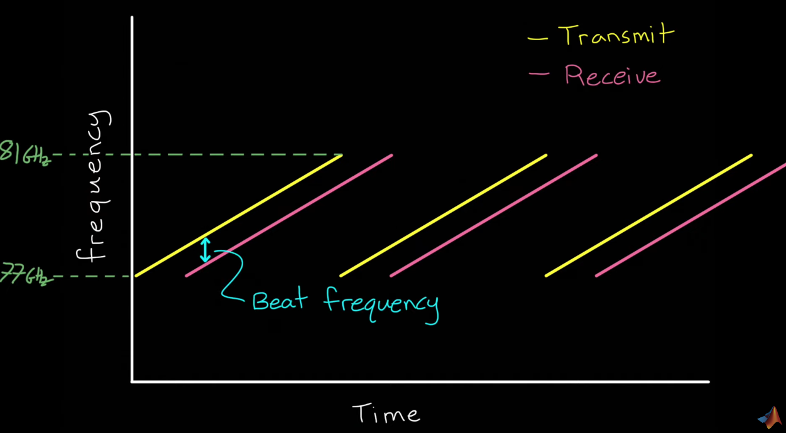

Things get complicated when we have multiple objects in scene. However, there are clever FM techniques to get around these problems.

# Heading angle/direcction (Azimuth & Elevation)

Heading direction determination is an important aspect of self driving car.

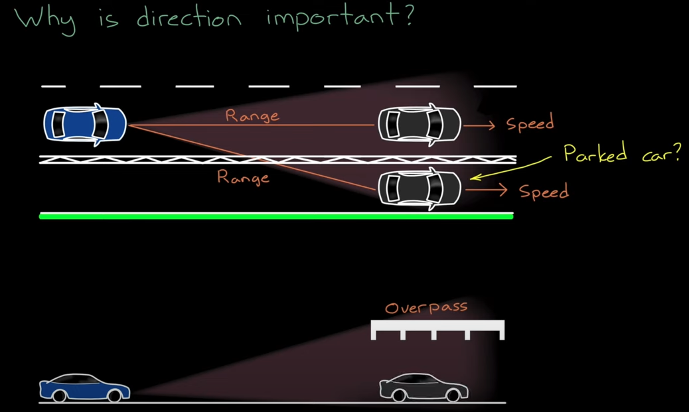

Heading angle is determined by a clever use of antenna's separated by a distance $d$.

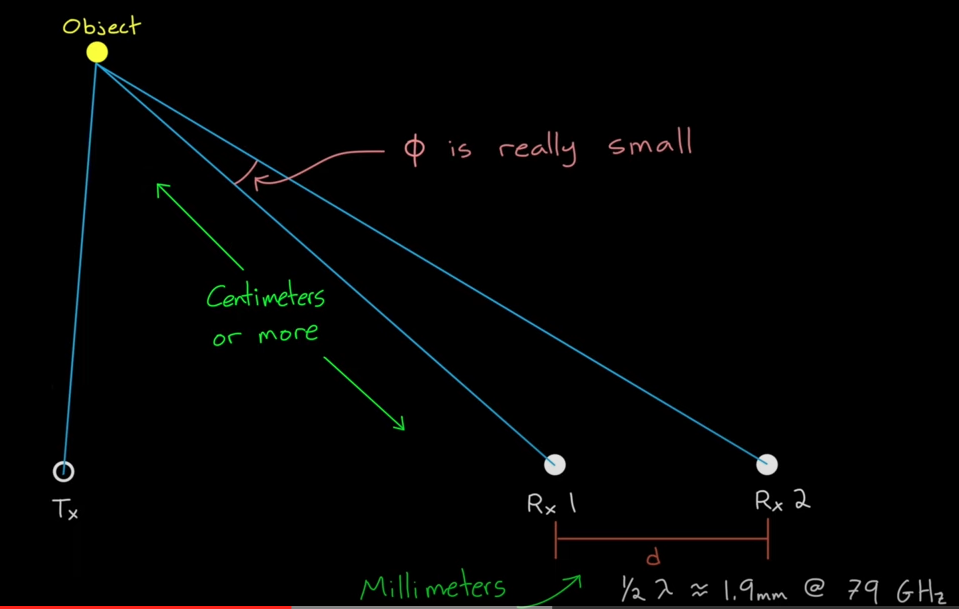

With the assumption that angle between 2 IQ singal $\phi$ is very small, we can treat 2 signal lines paralell. Therefore, with kown d (Design parameter), phase difference between 2 IQ singals (Unknwon) we can calculate $\theta$ (heading angle).

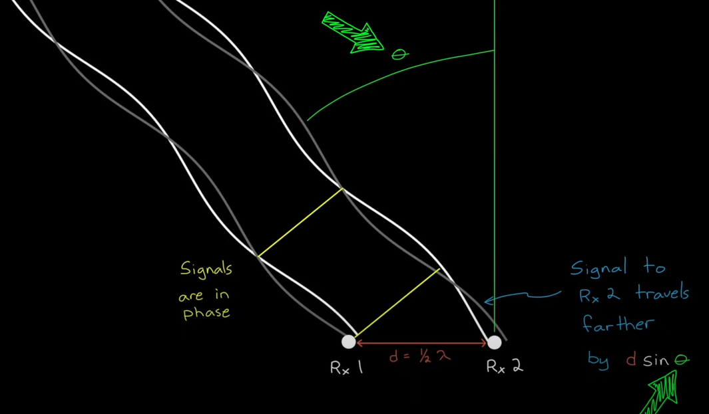

Phase diff is bit difficult to measure due to the noise. 

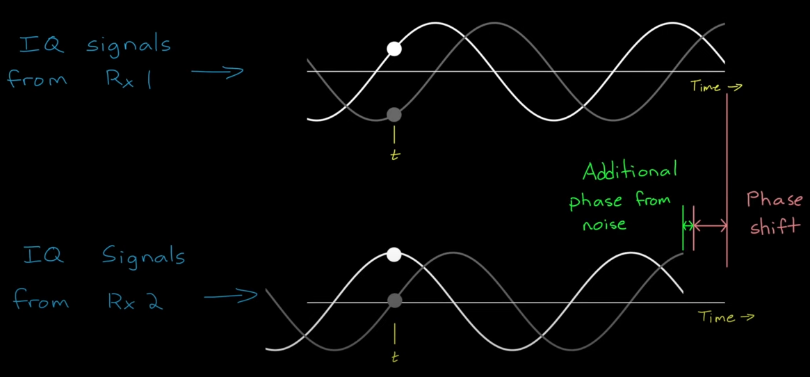

#### Anglular resolution

Angular resolution can be increased by adding more antennas by $d = 1/\lambda$ wavelength of the Tx. Making reflected signals travel farther to reach each antenna.

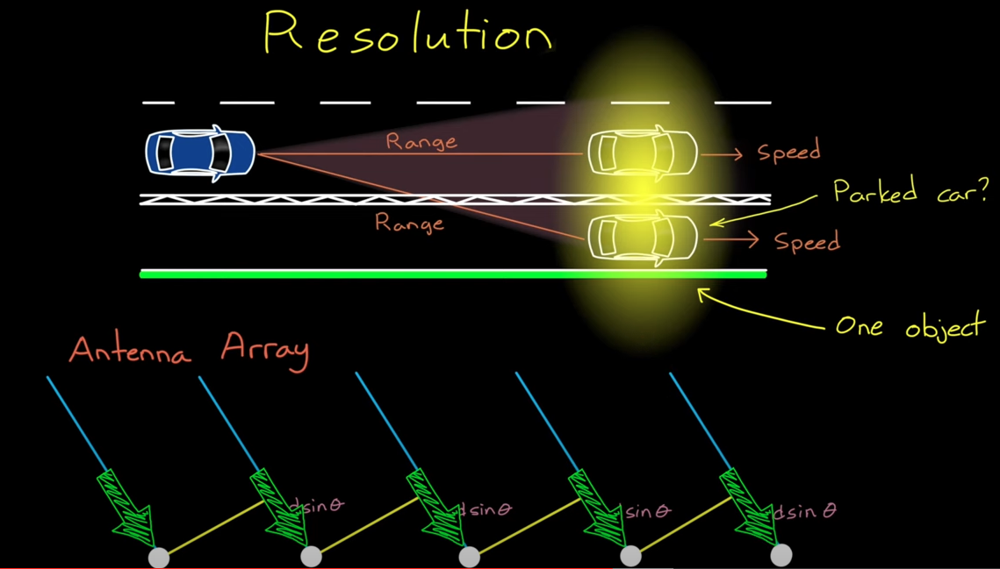

An interesting phenomena happens with antenna array. When Rx travels farther to reach each antenna, siganls (I & Q values) received at each antenna when plotted traces a sign wave.

Zero angle

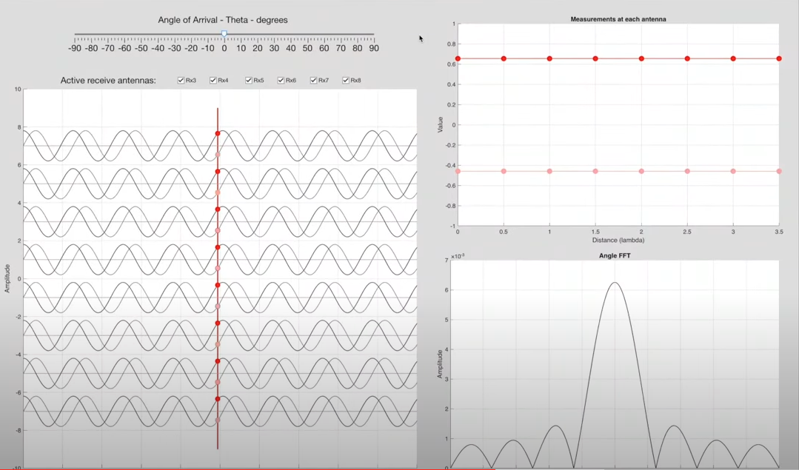

with some angle. Measurement of I & Q values at each antenna traces a sign wave. The FFT (Fast Fourier Transforms) of the sign wave created by the I&Q signals is shown bottom right corner (Amplitude vs $sin(\theta)$). Peak in the FFT represents the angle. In this example peak is at $sin(\theta) = 0.5 = 30°$ 

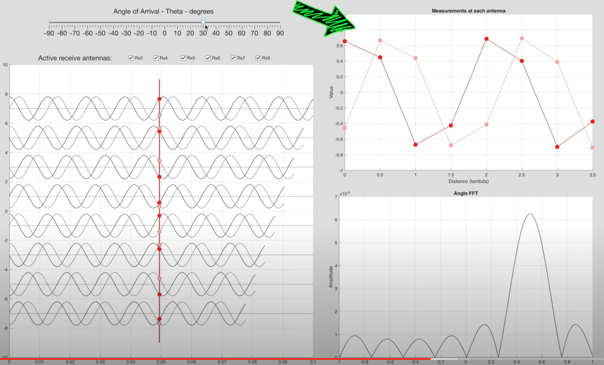

##### Sources
* [Brian Douglas](https://www.youtube.com/watch?v=-N7A5CIi0sg&t=301s) 

 